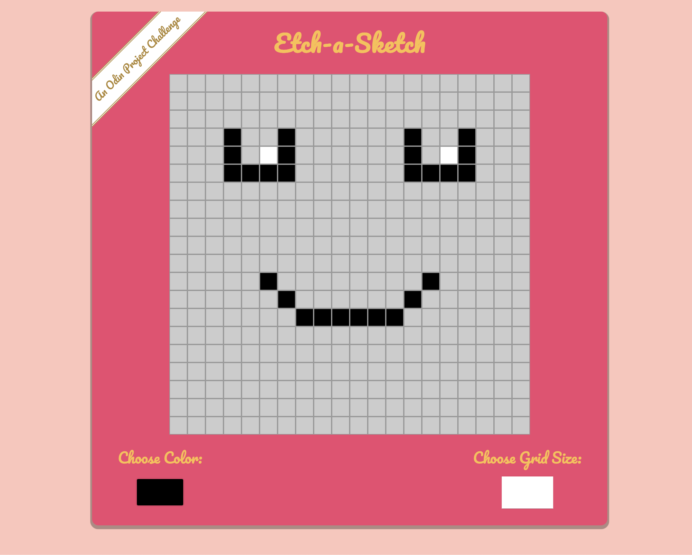

# Etch-a-Sketch

## Introduction

This project aims to create an Etch-a-Sketch-inspired browser-based sketchpad using HTML, CSS, and JavaScript. The goal is to implement a grid of square divs that users can interact with, changing the colors and size of the grid dynamically.

## Project Structure

The project comprises an HTML file (`index.html`), a CSS file (`styles.css`), and a JavaScript file (`script.js`). The HTML file sets up the structure of the webpage, including the grid container and input tools. CSS styles define the appearance and layout of elements, while JavaScript handles user interactions and grid creation.

## Project Features

- **Grid Creation**: The JavaScript file dynamically generates a grid of square divs within a container based on the user's input for grid size.
- **Color Selection**: Users can choose a color using the color picker input (`#color-picker`) to paint the grid squares.
- **Grid Resizing**: The input field (`#grid-size`) allows users to specify the number of squares per side for a new grid, maintaining the total space.

## Implementation Details

### Grid Creation

The `createGrid(num)` function in `script.js` calculates the dimensions of each grid square based on the container's width and dynamically generates the grid.

### Color Selection & Painting

Event listeners are added to the grid squares within the `.pixel-container`. When clicked or dragged over, they change their background color based on the selected color from the color picker input.

### Grid Resizing Feature

The `gridSize.addEventListener('keydown')` function listens for the 'Enter' key press in the grid size input field. Upon entering a value within the range of 1 to 100, a new grid is created with the specified number of squares per side.

## Usage

To use the Etch-a-Sketch:

1. Open `index.html` or [open my Github Page](https://alex-coding-3420.github.io/odin-project/Etch-a-Sketch/) in a web browser.
2. Choose a color using the color picker.
3. Input a grid size between 1 and 100 in the number input field to create a new grid.
4. Click on the grid squares to paint them with the selected color, and click again to stop painting.
