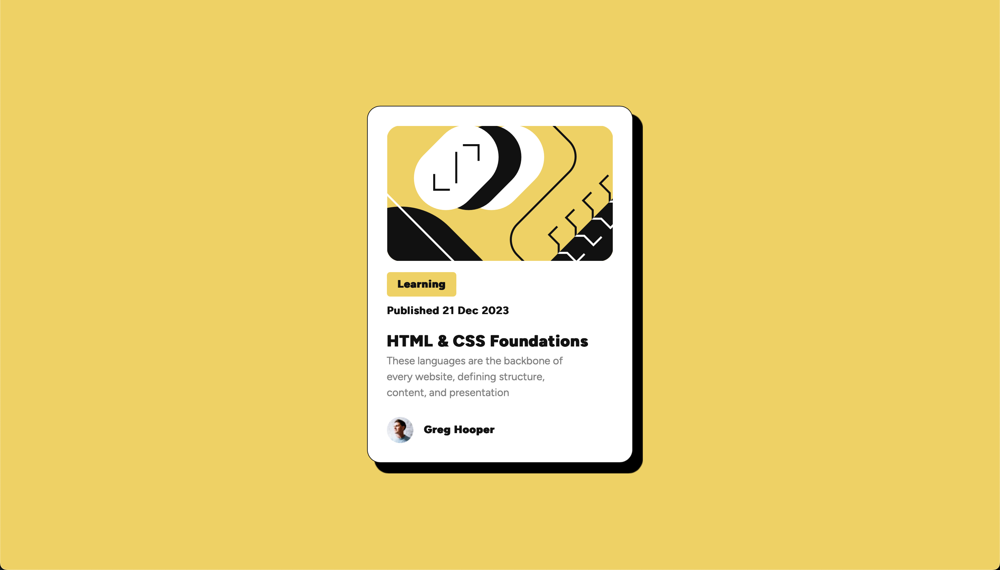

# Frontend Mentor - Blog preview card solution

This is my solution to the [Blog preview card challenge on Frontend Mentor](https://www.frontendmentor.io/challenges/blog-preview-card-ckPaj01IcS). Frontend Mentor challenges help you improve your coding skills by building realistic projects.

## Table of contents

- [Overview](#overview)
  - [The challenge](#the-challenge)
  - [Screenshot](#screenshot)
  - [Links](#links)
- [My process](#my-process)
  - [Built with](#built-with)

## Overview

### The challenge

Users should be able to:

- See hover and focus states for all interactive elements on the page

### Screenshot

### Links

- [Solution URL](https://github.com/Alex-coding-3420/alex-coding-3420.github.io/tree/main/projects/frontend-mentor/1-newbie/blog-preview-card-main)
- [Live Preview URL](https://alex-coding-3420.github.io/projects/frontend-mentor/1-newbie/blog-preview-card-main/index.html)

## My process

### Built with

- HTML 5
- CSS
- Flexbox
- Desktop-first workflow
